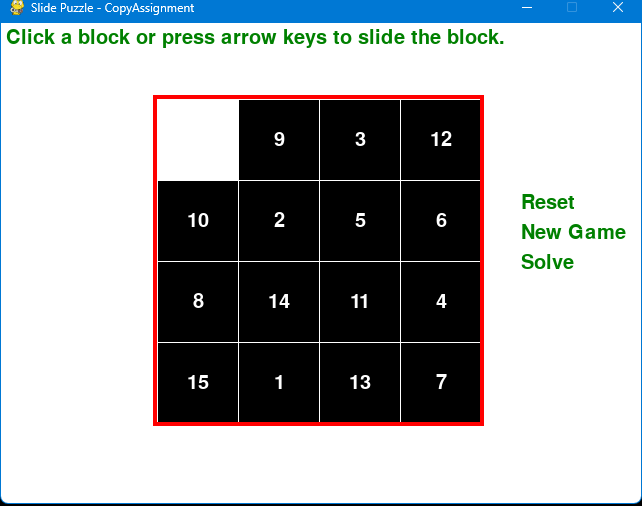

# Dino Game

## Description
Dino Game is an exciting Python-based Slide Puzzle game where the player needs to rearrange the tiles to solve the puzzle. Enjoy the challenge of sliding tiles into their correct positions!

## Features
- **Slide Puzzle:** Move tiles to solve the puzzle.
- **Randomization:** Generate new puzzles with random tile positions.
- **Reset:** Reset the current puzzle to start again.
- **Solve:** View the solution to the puzzle.
- **Keyboard Controls:** Use arrow keys (or 'W', 'A', 'S', 'D') to slide tiles.

## How to Play
1. Run the game by executing the Python script.
2. Click on tiles or use arrow keys to slide them.
3. Use options like Reset, New Game, and Solve to manage the game.

## Requirements
- Python 3.x
- Pygame library

## Installation
1. Clone the repository.
2. Install Pygame: `pip install pygame`
3. Run the game: `python dino_game.py`

## Controls
- Arrow Keys: Slide tiles
- 'R': Reset
- 'N': New Game
- 'S': Solve

## Screenshots

## License
This project is licensed under the GNU General Public License (GPL).

## Changelog
### Version 1.0
- Initial release

### Version 1.5
- Enhanced feature X for smoother gameplay.
- Fixed critical bug Y causing crashes.
- Added new feature Z for an improved gaming experience.

## Acknowledgments
- Special thanks to the Pygame community.

Enjoy playing Dino Game!
